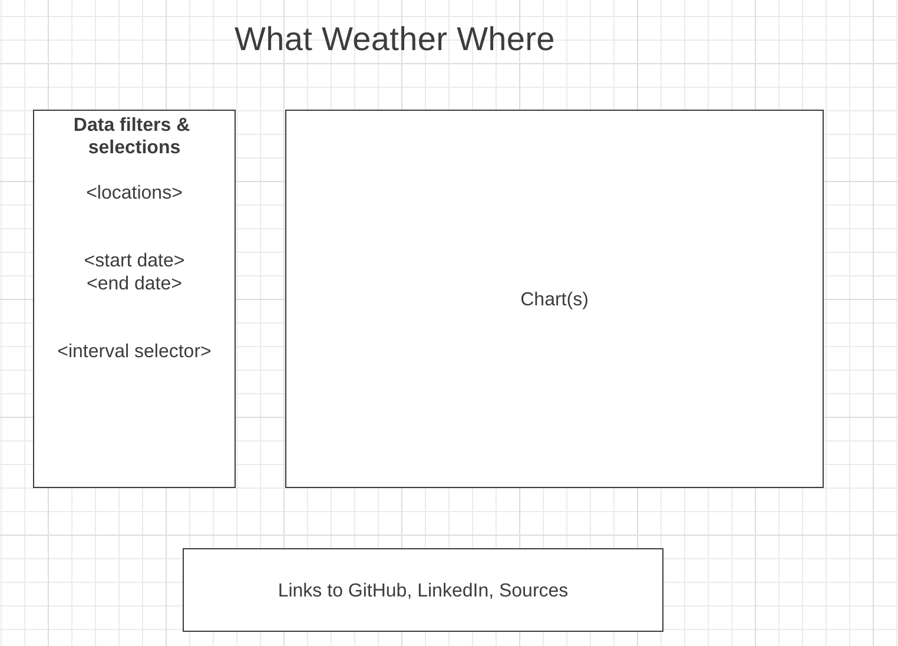

# What Weather Where 

## Background
If you're trying to plan you're next big adventure and don't want to find yourself sitting in the rain, freezing your butt off, or cramping from dehydration in sweltering heat, What Weather Where is here to help. This app will allow you to look at weather metrics for one or more locations in the Unites States. 

## Functionality & MVPs
In What Weather Where, users will be able to:
* Search US locations by zip code
* Select a timeframe for the data with a start and end date
* Toggle between days, weeks, & months
* View metrics for temperature, percipitation, and daylight

In addition, this project will include:
* An about section detailing the sources of data and metrics calculations
* A production README.

## Wireframes



* Enter locations, timeframes, and units on the left with a button to fetch data
* Charts will include legends and metrics.

## Technologies, Libraries, APIs
This project will be implemented with the following technologies:
* Weather data is populated using the Open-Mateo ```Historical Weather API``` [link](https://open-meteo.com/en/docs/historical-weather-api)
* Convert zip codes into coordinates using the Open-Mateo ``` Geocoding API ``` [link](https://open-meteo.com/en/docs/geocoding-api)
* ``` Webpack ``` and ``` Babel ``` to bundle and transpile the source Javascript code.
* ``` npm ``` to manage project dependencies

## Implementation Timeline

* __Thursday Afternoon & Friday__: Set up fetches for the weather & daylight APIs. Understand the data, figure out how to access the appropriate fields. Get comfortable with Danfo.js. Get a chart setup for average daily highs for a single zip code.

* __Weekend__: Add functionality to add/change locations. Get comfortable aggregating and calculating metrics by different time periods and units. Finalize chart types and combinations for the metrics.

* __Tuesday__: Make sure all the html functionality is working. Continue implementing charts. Add sources, About page and links.

* __Wednesday__: Focus on styling & layout. Add bonus features as time allows.

* __Thursday__: Deploy to GitHub pages. Create a production README.


## Bonus Features

If time allows, here are a couple updates & features that would make this tool better:

* Use international weather data
* Location search by zip codes, names, or addresses with auto-complete